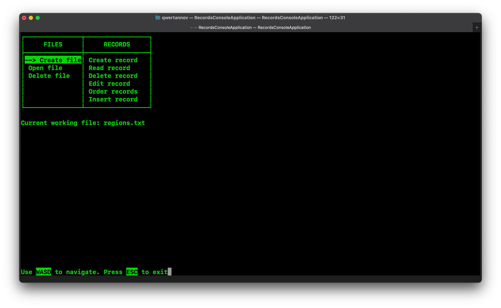

# Console Records Application - My Notes

This is my personal readme for the console records application I built. It details the libraries I used, their purpose, the functionalities of the application, and the things I learned along the way.

## Libraries Used

- `<stdio.h>`: Provided functions for getting user input (`scanf`) and displaying information (`printf`).
- `<termios.h>`: Helped control the terminal for a smoother user experience.
- `<unistd.h>` and `<stdlib.h>`: Offered essential functions for managing files (open/close) and memory (malloc/free).
- `<ctype.h>` and `<string.h>`: Came in handy for classifying characters (uppercase/lowercase) and manipulating strings (comparisons).
- `<sys/ioctl.h>` and `<sys/stat.h>`: Gave access to system calls for getting file information.
- `<dirent.h>`: Helped navigate directories when dealing with multiple data files.

## Why These Libraries?

Each library played a specific role:

- The first bunch (`stdio.h`, `termios.h`) handled user interaction and the terminal interface.
- The next group (`unistd.h`, `stdlib.h`) took care of file management and memory allocation.
- The following two (`ctype.h`, `string.h`) assisted with character and string manipulation.
- The last three (`sys/ioctl.h`, `sys/stat.h`, `<dirent.h>`) provided functionalities for system calls and working with directories.

## What This Application Can Do

### File Management

- Create new data files.
- Open existing data files for access.
- Delete data files when they're no longer needed.

### Record Management

- Create new records within a data file.
- Read existing records to see the information stored.
- Delete records when they become outdated.
- Edit existing records to keep things accurate.
- Insert new records into the data file, keeping things organized (sorted or unsorted, depending on your preference).
- Sort records based on different criteria (name, area, population) with your choice of order (ascending or descending).

## What I Learned

This project was a great learning experience! I explored:

### C Programming

- File I/O operations (reading, writing, creating, deleting).
- Memory management techniques (malloc, realloc, free) to avoid memory leaks.
- Working with structures to efficiently represent records within the data files.
- String manipulation functions for processing user input and data.
- User interaction through the terminal with menus and keyboard navigation.

### Data Structures

- Using structures to create a clear and organized way to store record information.

### Algorithms

- Sorting algorithms (comparison functions) to keep data organized.
- Searching algorithms (finding the right spot) for inserting new records efficiently (especially when sorted).

## Additional Notes

- The application uses a designated folder (`./files`) to store all your data files.
- The code includes error handling to catch potential issues during file operations and user input validation.
- The interface is designed to be user-friendly, with a menu system and keyboard navigation for a smooth experience.
